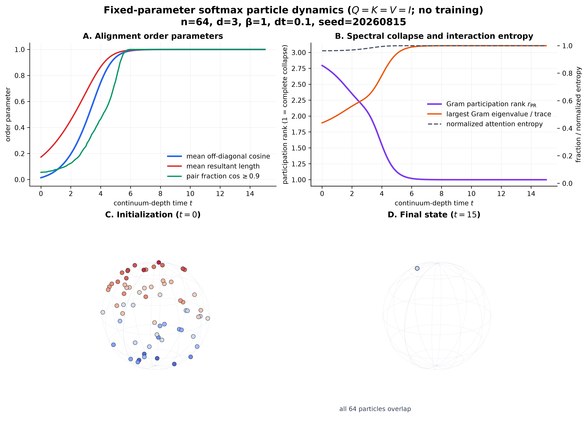

# Perspective clustering：固定参数、确定性基线

## 一句话结论

在官方代码使用的 (Q=K=V=I) 粒子系统中，64 个三维单位向量从近似各向同性的
随机云演化为单点：平均非对角 cosine 从 (0.01447) 升到
(0.9999999996)，Gram participation rank 从 (2.7948) 降到
(1.0000000007)。但是最终 attention **不是稀疏选择某个 token**，而是严格趋向均匀；
因此这里复现的是固定 interaction kernel 导致的全局表示聚类，不是训练学出的因果
routing，也不是 learned superposition。



## 1. 复现了什么

来源是 *A Mathematical Perspective on Transformers* 的
[论文](https://arxiv.org/abs/2312.10794)和作者的
[官方仓库](https://github.com/borjanG/2023-transformers-rotf)。本项目把官方仓库固定在
commit `538ba839f7fc03d042e03ad7b557c220defc4148`，并保留
官方 [`sphere.py`](https://github.com/borjanG/2023-transformers-rotf/blob/538ba839f7fc03d042e03ad7b557c220defc4148/sphere.py)
原文件；仓库中的 submodule 同样固定在 commit `538ba839f7fc03d042e03ad7b557c220defc4148`。

官方脚本同时做数值积分、三次插值、151 帧绘图和未设种子的随机初始化。这里没有直接
运行它，而是只抽出其数学循环，固定随机种子，并一次生成可审计的轨迹和图。默认配置为


| 变量 | 数值 | 意义 |
|---|---:|---|
| (n) | 64 | token/粒子数 |
| (d) | 3 | 每个粒子所在球面的环境维数 |
| (\beta) | 1 | softmax inverse temperature |
| (T) | 15 | continuum-depth 终点；**不是训练时间** |
| (Delta t) | 0.1 | 显式 Euler 步长 |
| seed | 20260815 | `np.random.randn` 对应的固定 legacy NumPy seed |

完整实现是
[`clustering_baseline.py`](../src/routing_lab/clustering_baseline.py)，恒等式与确定性测试是
[`test_clustering_baseline.py`](../tests/test_clustering_baseline.py)。

## 2. 数学模型与官方代码的逐项对应

初始化 (z_i^0\in\mathbb S^{d-1}) 是归一化 Gaussian：

\[
g_i\sim\mathcal N(0,I_d),\qquad z_i^0=\frac{g_i}{\lVert g_i\rVert_2}.
\]

固定 (Q=K=V=I) 时，第 (k) 步的 score 与 attention 为

\[
s_{ij}^k=\beta (z_i^k)^\top z_j^k,\qquad
a_{ij}^k=\frac{\exp(s_{ij}^k)}{\sum_{r=1}^n\exp(s_{ir}^k)}. \tag{1}
\]

加权 value interaction、Euler proposal 和逐行球面回缩是

\[
u_i^k=\sum_{j=1}^n a_{ij}^kz_j^k,\qquad
\widetilde z_i^{k+1}=z_i^k+\Delta t\,u_i^k,\qquad
z_i^{k+1}=\frac{\widetilde z_i^{k+1}}
{\lVert\widetilde z_i^{k+1}\rVert_2}. \tag{2}
\]

这分别对应官方 `sphere.py` 中的 `exp_beta_dot`、`attention`、`dlst`、Euler 加法和最后
一行 normalization。实现使用减去 row maximum 的稳定 softmax；该常数在分子分母中
严格消去，所以没有改变式 (1)。测试直接用官方式子的朴素 NumPy 展开计算，并逐元素
比较 attention 与下一步状态，误差阈值 (10^{-15})。初始化测试还验证：给定同一 seed，
本实现与在官方 `np.random.randn` 前调用 `np.random.seed(seed)` 得到的初始点逐元素相同。

当 (Delta t\to0) 时，归一化 Euler 步满足

\[
\frac{z_i+\Delta t\,u_i}{\lVert z_i+\Delta t\,u_i\rVert}
=z_i+\Delta t\,(I-z_iz_i^\top)u_i+O(\Delta t^2),
\]

所以它离散化的是论文所研究的球面切空间动力学

\[
\dot z_i=(I-z_iz_i^\top)\sum_j a_{ij}(z)z_j. \tag{3}
\]

## 3. 记录的 order parameters

令 (G_{ij}=z_i^\top z_j)。每个 (t=k\Delta t) 都保存以下量，而不是只保存好看的
初末图。

1. 平均非对角 cosine

   \[
   \rho(t)=\frac{1}{n(n-1)}\sum_{i\ne j}G_{ij}.
   \]

2. 平均 resultant length (R(t)=\lVert n^{-1}\sum_i z_i\rVert_2)。它与上一指标满足
   可检查的精确恒等式

   \[
   \rho(t)=\frac{nR(t)^2-1}{n-1}. \tag{4}
   \]

3. Gram participation rank 和最大谱质量

   \[
   r_{\rm PR}(G)=\frac{\operatorname{tr}(G)^2}
   {\operatorname{tr}(G^2)}
   =\frac{n^2}{\sum_{ij}(z_i^\top z_j)^2},\qquad
   p_{\max}=\frac{\lambda_{\max}(G)}{n}. \tag{5}
   \]

   各向同性三维云的 (r_{\rm PR}) 接近 3；全部粒子重合时恰为 1。

4. 高对齐 pair 比例

   \[
   P_{0.9}(t)=\frac1{n(n-1)}\sum_{i\ne j}
   \mathbf1\{G_{ij}\ge0.9\}.
   \]

5. 归一化 attention entropy

   \[
   H_A(t)=\frac1{n\log n}\sum_i\left[-\sum_j a_{ij}\log a_{ij}\right]. \tag{6}
   \]

此外还记录 mean absolute cosine、每个点的 nearest-neighbor cosine、单位范数最大误差。
最后一项全程不超过 (2.23\times10^{-16})，验证球面约束在 float64 精度内成立。

## 4. 结果


| 时刻/事件 | (t) | 观测 |
|---|---:|---:|
| 初始化 | 0.0 | (\rho=0.01447, r_{PR}=2.7948, p_{max}=0.4395) |
| (\rho\ge0.5) 首次发生 | 3.3 | 表示云已经出现全局一致方向 |
| (\rho\ge0.9) 首次发生 | 4.7 | 绝大多数几何差异已经消失 |
| (r_{PR}\le1.1) 首次发生 | 5.2 | Gram 谱几乎 rank one |
| (P_{0.9}\ge0.9) 首次发生 | 5.3 | 至少 90% 有序 token pair 高度对齐 |
| 终点 | 15.0 | (\rho=0.9999999996, r_{PR}=1.0000000007, p_{max}=0.9999999996) |

一个容易误读、但很关键的现象是 (H_A(15)=1)。粒子完全重合时
(z_i^\top z_j=1) 对所有 (i,j) 相同，所以

\[
a_{ij}=1/n.
\]

也就是说：**状态 clustering 可以与完全均匀的 attention 同时出现。** 图中的 collapse
不能解释成模型“选中了正确 token”；这里甚至没有 query、target、label 或 loss。

机器可读结果：

- [`trajectory.csv`](../results/clustering-baseline-v1/trajectory.csv)：151 个 checkpoint 的
  平坦指标表；
- [`trajectory.json`](../results/clustering-baseline-v1/trajectory.json)：同一指标轨迹、配置、
  官方 commit、初始和最终三维坐标；
- [`clustering_baseline.svg`](../results/clustering-baseline-v1/clustering_baseline.svg)：
  可编辑矢量图；
- [`clustering_baseline.png`](../results/clustering-baseline-v1/clustering_baseline.png)：
  320 DPI 预览图。

## 5. 怎样复现

在项目根目录安装声明的依赖后运行：

```bash
python -m pip install -e .
python -m routing_lab.clustering_baseline \
  --output results/clustering-baseline-v1 \
  --n-particles 64 --dimension 3 --beta 1 \
  --T 15 --dt 0.1 --seed 20260815
```

运行数学恒等式、确定性和文件可读性测试：

```bash
python -m unittest -v tests.test_clustering_baseline
```

命令重复执行会给出逐元素相同的 JSON/CSV 数值；SVG 中少量 metadata 可能由 Matplotlib
版本决定，不用作数值确定性判据。

## 6. 与两个主问题的严格关系

### 6.1 与“复合 routing kernel 的训练选择理论”

Perspective 基线固定 interaction kernel，研究的是层/continuum-depth 时间 (t) 中
(z_i(t)) 如何运动。我们的主问题固定有限架构，研究训练时间 (s) 中

\[
E(s),\quad B(s)=W_Q(s)^\top W_K(s),\quad
C(s)=W_O(s)W_V(s),\quad w_{out}(s)
\]

如何被 population gradient flow 选择。两个时间和两个问题不能混同。

本基线的实验价值是提供一个明确反例：global clustering
(\rho\to1, r_{PR}\to1) 并不推出任务相关 routing。训练选择理论必须证明的 order
parameter 应该是 target-selective 几何

\[
\Delta\rho=\cos(x_q,x_J)-\frac1{m-1}\sum_{i\ne J}\cos(x_q,x_i),
\]

以及端到端因果 value kernel (kappa_J\to1, kappa_{i\ne J}\to0)，而不是单独证明
global cosine 增大或 attention 图变尖。

### 6.2 与“learned superposition 的下游补偿理论”

本基线把同一 episode 内 token cloud 的有效秩从约 3 压到 1；这是 information-destroying
collapse。主实验中的 compressed concept dictionary 则研究 (C>d) 时多个 concept 如何
共享 (d) 维表示，并由 QK、OV 或 FFN 保留/恢复任务相关函数。二者都可能表现为“有效秩
下降”，但数学对象不同：前者是 token-state Gram (ZZ^\top)，后者是 learned embedding
dictionary (EE^\top)。

因此这项 baseline 的角色是负对照和坐标系：它告诉我们不能把 participation rank 下降
本身称作 superposition，也不能把 clustering 本身称作 downstream compensation。只有
on-manifold swap 产生可测 cross-talk、并且路径诊断显示 QK/OV/FFN 抑制该 cross-talk，
才能支持后一个主问题。

## 7. 这项复现没有声称什么

- 没有 optimizer、loss、label 或训练数据，所以不回答“梯度下降为何选择某个 kernel”；
- 只验证作者公开代码中的 (A=V=I) 特例，不声称覆盖多头、FFN、residual normalization
  或 learned embeddings；
- 单 seed 是固定基线而非跨 seed 统计推断；确定性测试证明可复现，但不把该 seed 当作
  population；
- collapse 是这个固定有限离散化的实证轨迹；论文中的定理条件与连续时间结论仍以原文
  为准。
