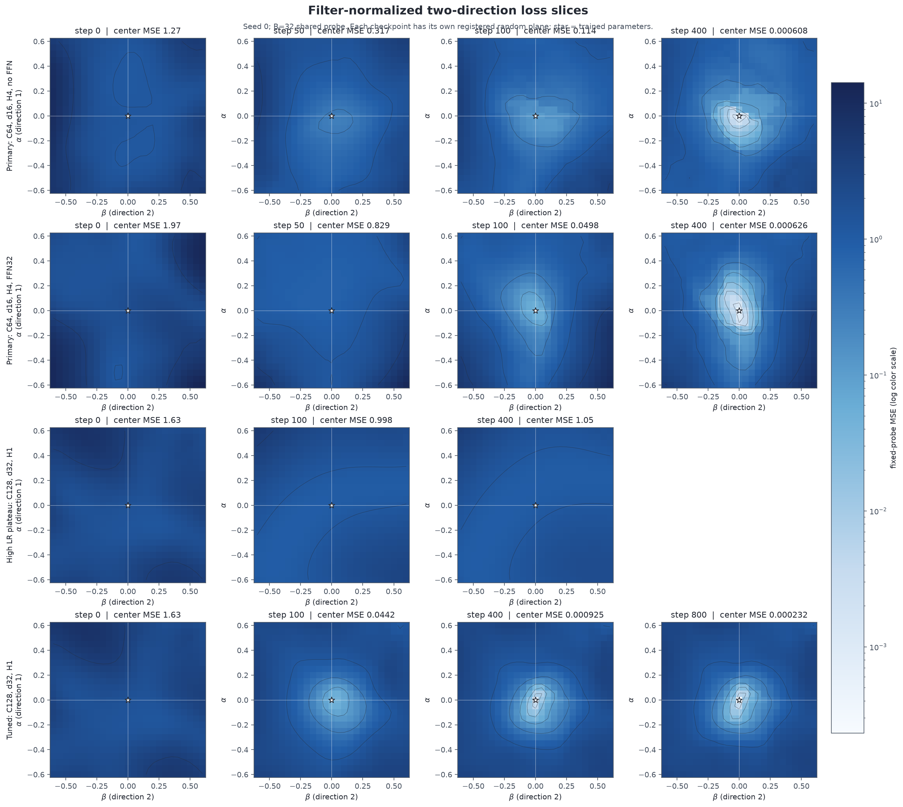
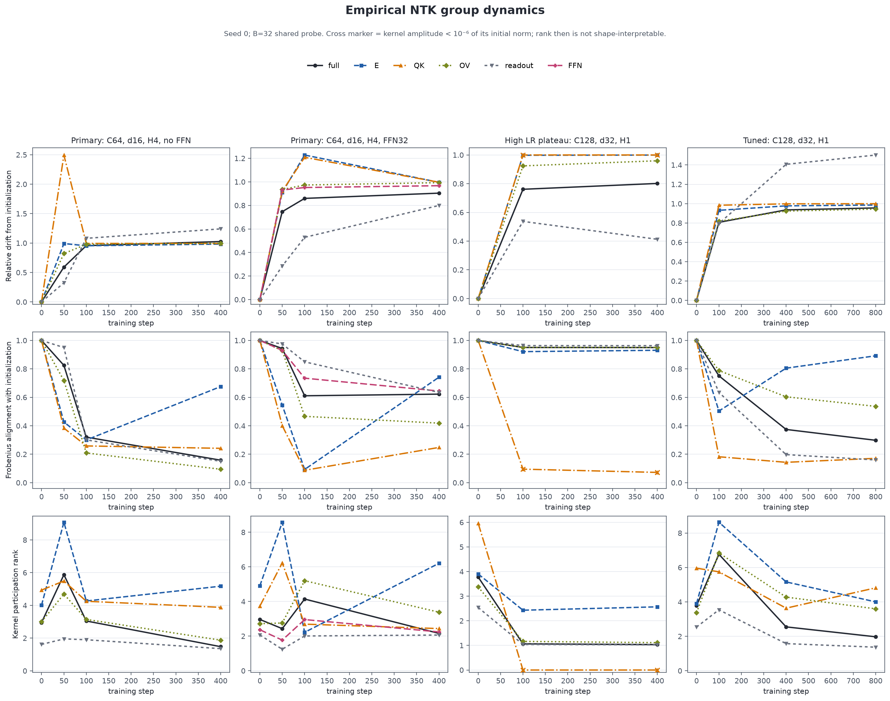
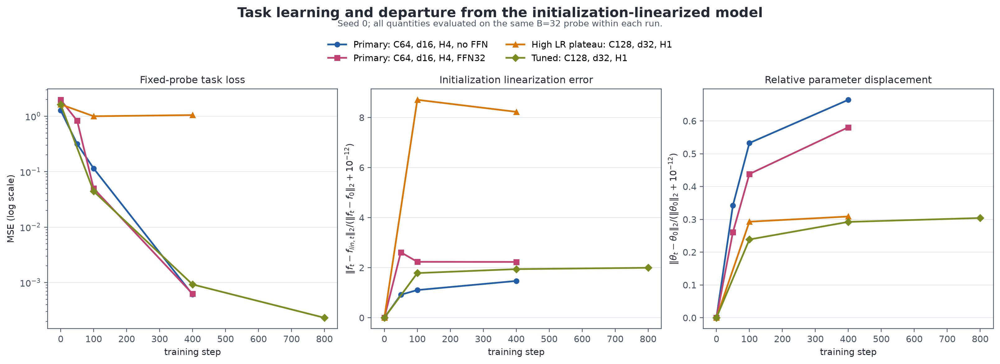
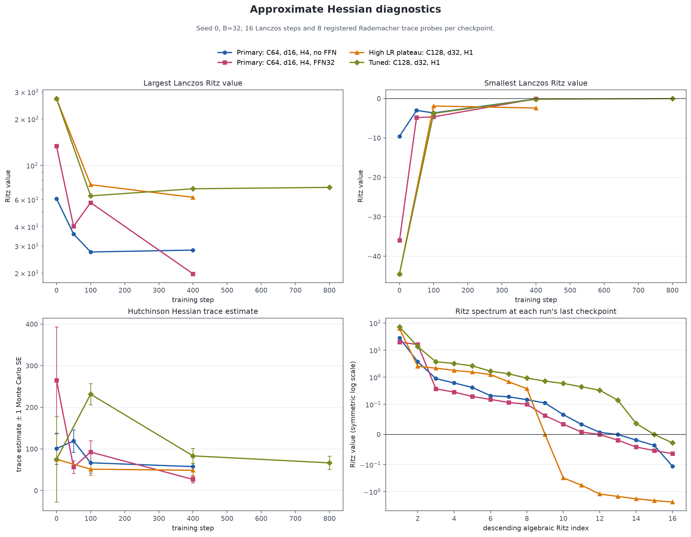

# Optimization dynamics、loss landscape 与 routing 成败个案

## 结论先行

这四条轨迹回答的是一个有限而具体的问题：**在同一个 exact-softmax causal retrieval Transformer 中，成功学出 retrieval routing 和停在 chance-level plateau 时，局部 loss slice、经验 NTK、初始化线性化误差与 Hessian 近似各是什么样？**

最强的机制对照是 `highlr_plateau` 与 `tuned`。两者都是 seed 0，模型结构、AdamW、batch size、momentum、weight decay、初始化 checkpoint、训练数据随机数设计和诊断 probe 相同；注册的 step-0 数组逐字节相等。差别是 learning rate `0.01` 对 `0.003`，以及总训练时长 `400` 对 `800`。在共同的 step 400：

- 大评估集（`B=8192`）上，high-LR 的 MSE/accuracy 是 `1.00834` / `0.4982`；tuned 是 `0.000462643` / `1.0000`。
- high-LR 的 value-flip effect 和 target-key effect 是 `-1.23e-06`、`-1.46e-06`，接近零；tuned 是 `0.9986`、`0.9877`。因此这里观测到的不只是 loss 差异，而是“是否形成任务相关 causal routing”的功能差异。
- high-LR 的 QK 经验核 Frobenius norm 从 `0.07517` 降到 `5.616e-11`；tuned 在 step 400 为 `0.001049`。前者的 QK tangent sensitivity 在这个 probe 上几乎消失，后者仍可测。但这不能单独证明“QK collapse 导致失败”；两者都是训练结果。
- 初始化的一阶模型在两条轨迹上都不够：step 400 的相对线性化误差分别为 `8.227` 与 `1.944`，均大于 1。只用固定初始 NTK 解释 routing selection 会漏掉主要的非线性特征学习。

这是一个**单 seed、共同初始化的机制个案**，不是 learning-rate 因果效应的多 seed 估计。它证明“这种失败/成功分化在受控个案中真实存在”，不证明它对初始化总体成立。

## 1. 网络、数据与被测量的量

四个诊断都来自项目的 causal associative-retrieval 模型。每个 episode 有 `m=4` 个互异 concept，值为 iid Rademacher 变量；query 指向其中一个 concept，label 是其对应值。网络是 2 层 pre-RMSNorm causal Transformer，使用 exact softmax、factorized QK/OV、残差 readout；FFN 个案的宽度为 32。

固定诊断 batch 为同一组 `B=32` episodes。记其预测向量为 `f_t in R^B`，label 为 `y`：

```math
L_t = B^{-1}\|f_t-y\|_2^2.
```

### 经验 NTK

对参数组 `g in {E,QK,OV,FFN,readout}`，诊断存储

```math
K_t^g = J_t^g(J_t^g)^T/P_g,
```

并计算

```math
D_t^g=\frac{\|K_t^g-K_0^g\|_F}{\|K_0^g\|_F+10^{-12}},\qquad
A_t^g=\frac{\langle K_t^g,K_0^g\rangle_F}{\|K_t^g\|_F\|K_0^g\|_F+10^{-12}},
```

```math
r_{eff}(K_t^g)=\frac{\operatorname{tr}(K_t^g)^2}{\operatorname{tr}((K_t^g)^2)+10^{-12}}.
```

每个 group 用自己的 `P_g`，所以 norm 不能被误读为不同组对输出的直接可加贡献。若一个核的 norm 已低于初始值的 `10^-6`，图中用叉号；此时上式的 effective rank 主要反映“幅度消失”，不应作通常的 rank 解释。

### 初始化线性化

```math
f_{lin,t}=f_0+J_0(\theta_t-\theta_0),\qquad
e_{lin,t}=\frac{\|f_t-f_{lin,t}\|_2}{\|f_t-f_0\|_2+10^{-12}}.
```

`e_lin > 1` 表示初始 Jacobian 给出的函数变化误差，比模型真实函数移动本身还大；它是“固定初始化线性化不充分”的直接诊断，不是对任意 time-varying kernel theory 的否定。

### Loss landscape 与 Hessian

每个 checkpoint 独立注册两条 per-tensor filter-normalized Gaussian direction：

```math
\mathcal L_t(\alpha,\beta)=L(\theta_t+\alpha d_{1,t}+\beta d_{2,t}),
\qquad \|d_{j,t}^{(k)}\|_F=\|\theta_t^{(k)}\|_F.
```

网格为 `[-0.6,0.6]^2` 的 25 x 25 点。不同 checkpoint 的 plane 不是同一全局平面，因此只能比较各自局部切片形状，不能把它们连成优化轨迹。全参数 Hessian 另用 16 步 Lanczos 给 Ritz 近似、8 个固定 Rademacher probe 给 Hutchinson trace；Ritz 负值数量不等于完整 Hessian 的负特征值数。

## 2. 数据完整性与 provenance

| dynamics 个案 | seed | checkpoints | contract SHA 前 12 位 | init snapshot SHA 前 12 位 | 已复核 snapshot 数 |
|---|---:|---:|---|---|---:|
| Primary: C64, d16, H4, no FFN | 0 | 4 | a48877d9052e | 8fa29d6a8289 | 4 |
| Primary: C64, d16, H4, FFN32 | 0 | 4 | d6dd7d2c7626 | d9edafd9f422 | 4 |
| High LR plateau: C128, d32, H1 | 0 | 3 | 56ac9a4ae95c | 9f55a1ad231f | 3 |
| Tuned: C128, d32, H1 | 0 | 4 | bba5a3a301d5 | 9f55a1ad231f | 4 |

分析脚本完成了六层检查：`_SUCCESS -> contract_hash`、重算 contract、`arrays.npz` SHA-256、NPZ key/dtype/finite 值、由数组重算 loss/accuracy/NTK/linearization/Hessian trace/landscape scalar、逐个回溯 source snapshot SHA-256。plateau/tuned 的 `23` 个 probe/initialization/step-0 数组逐字节相等。两个训练 artifact 记录的 git commit 不同，但 data/model/training/run 四个相关源文件在两 commit 间无 diff：`True`。

训练 runner 的 private data generator 只由 seed 派生，所以该 pair 被设计为在共同的前 400 步消费相同随机 episode 流。**限制：训练 batch 本身没有逐批保存 hash**，因此这是代码与配置层面的 common-random-number provenance，不是逐 batch 字节审计。

## 3. Plateau 与 tuned：同初始化的可测差异

| step | probe MSE high-LR | probe MSE tuned | probe acc high-LR | probe acc tuned | B=8192 MSE high-LR | B=8192 MSE tuned |
|---:|---:|---:|---:|---:|---:|---:|
| 100 | 0.9983 | 0.04419 | 0.594 | 1.000 | 1.001 | 0.03522 |
| 400 | 1.049 | 0.0009249 | 0.406 | 1.000 | 1.008 | 0.0004626 |

### 3.1 Loss slice

step 400 的 high-LR 中心 MSE 为 `1.04857`，该 25 x 25 plane 的最小值为 `0.955635`，有 `24.3%` 网格点低于中心；中心并非此 plane 的 3 x 3 局部最小。tuned 的中心 MSE `0.000924942` 就是注册网格最小值，没有网格点更低。这个事实说明 plateau checkpoint 仍有某些随机组合下降方向，而不是说明存在通往 retrieval 解的全局低障碍路径。



### 3.2 NTK 与非线性移动

high-LR 在 step 400 的 full-kernel drift/alignment/effective-rank 为 `0.802` / `0.950` / `1.033`；tuned 为 `0.935` / `0.374` / `2.549`。high-LR 的 full kernel 仍与初始化高度对齐，但 group kernel amplitudes 收缩且功能停在 chance；tuned 的 alignment 更低并学出 routing。它支持“成功训练伴随明显 feature/kernel reorganization”这一具体观察，但不把任何单个 NTK statistic 宣称为充分机制。





### 3.3 Hessian 近似

共同的 step 400，plateau 的最小/最大 Ritz 值为 `-2.413` / `62.07`；tuned 是 `-0.1768` / `70.56`。trace 估计分别为 `48.832 ± 15.997` 与 `83.390 ± 17.900`。8-probe Monte Carlo error 很宽，不能据此声称 trace 有显著差异；可复现的较稳事实是 plateau 保留了更负的极端 Ritz 近似，而 tuned 到 step 800 的最小 Ritz 近似收缩到 `-0.02801`。



## 4. Primary FFN / no-FFN 个案说明什么

两个 `C=64,d=16,H=4` primary 个案在 step 400 的固定-probe MSE 都约为 `6e-4`：no-FFN `0.000608189`，FFN `0.000626181`，accuracy 均为 1。与此同时：

- no-FFN 的 full-NTK drift/alignment 为 `1.026` / `0.158`；FFN 为 `0.904` / `0.622`。
- 初始化线性化相对误差仍为 `1.470` 和 `2.231`，所以“最终低 loss”并不意味着训练留在 lazy/NTK 近似内。
- 两个最终 checkpoint 都是各自 25 x 25 随机 plane 的网格最小值；这只说明被抽到的两个方向，没有证明全参数局部极小。

FFN 与 no-FFN 在这里都能解任务，因此这些 seed-zero 图不能证明 FFN 是必要补偿器。FFN 是否对 learned superposition cross-talk 进行补偿，必须回到 on-manifold swap、tangent intervention 和 branch-residual cancellation 的多 seed 定位结果，而不能由 Hessian/landscape 反推。

## 5. 对两个理论 open problem 的价值边界

1. **复合 routing kernel 的训练选择理论。** 实验给出一个明确约束：同初始化的有限 AdamW 动力学可以在 routing effects 约为 0 的 plateau 与 routing effects 约为 1 的解之间分化；成功轨迹伴随明显 NTK drift，且固定初始 Jacobian 误差很大。因此，若理论目标是 population gradient flow 的早期闭合方程，必须清楚区分它能否预测有限步长 AdamW 的 selection/plateau，并把学习率或离散化稳定区间作为单独命题，而不能把 population-GF 结论直接外推。
2. **learned superposition 的下游补偿理论。** 这些 dynamics diagnostics 证明 successful feature learning 很非线性，却不能定位 cross-talk 在 QK、OV 或 FFN 哪一步被消除。它们是 intervention 实验的背景条件和失败对照，不是补偿证据本身。

## 6. 严格限制

- **统计单位只有 seed 0。** checkpoint、NTK group、Lanczos Ritz value、trace probe 和 landscape grid point 都是同一训练实例内的重复测量，不能冒充独立样本。
- dynamics probe 只有 `B=32`；功能结论同时报告 source runner 的 `B=8192` 独立固定评估集，几何/Hessian 结论仍只针对 `B=32`。
- high-LR/tuned 是高度受控的 pair，但 learning rate 与 horizon 同时改变，且不是跨 seed 随机化。最早 step 100 已分化，所以 step 400 的差异不是由 tuned 额外 400 步单独造成；仍不能从一个 pair 估计总体因果效应。
- 2-D loss surface 是随机局部切片；Lanczos 和 Hutchinson 是有限预算近似。它们用于提出可测机制，不用于宣称完整 landscape 拓扑。
- 经验 NTK 是 probe-conditioned 的 tangent geometry，不等同于 attention routing kernel，也不等同于 QK logits 本身。

## 7. 复现

从项目根目录执行：

```bash
PYTHONPATH=src python -m routing_lab.dynamics_analysis
PYTHONPATH=src python -m unittest -v tests/test_dynamics_analysis.py
```

输出目录 `results/dynamics-analysis-v1` 包含：

- `run_steps.csv`：run/checkpoint 级 task、linearization、landscape、Hessian 摘要；
- `ntk_groups.csv`：每个参数组的 drift/alignment/effective-rank/norm；
- `hessian_ritz.csv`：全部注册 Ritz 近似；
- `loss_landscape_cells.csv`：所有 25 x 25 网格值；
- `provenance.csv` 与 `summary.json`：hash 链、pair audit 和解释边界；
- 四组 PNG/SVG 图，PNG 便于浏览，SVG 可直接用于论文排版。
